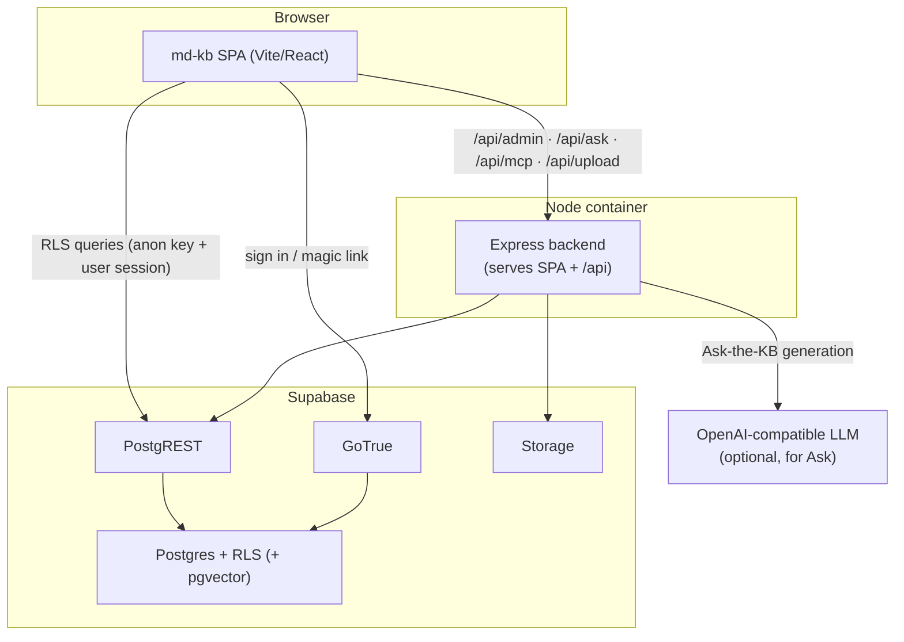

# md-kb — Architecture

The single reference for how the app fits together: the SPA, the thin backend,
authentication and authorization, search & Ask-the-KB, the MCP connector, and
how it's deployed. For deep dives see the linked ADRs.

## Overview

md-kb is a self-hosted, RLS-secured Markdown knowledge base. It serves public
reading (full-text + fuzzy search, optional "Ask the KB") and an editorial
workspace: per-user private drafts, optional mandatory review, version history,
trash, an audit log, bulk Markdown import/export, and an admin settings panel.

The whole product is one deployable: a Vite/React single-page app plus a thin
Express backend, talking to Supabase (Postgres + PostgREST + GoTrue + Storage).
Row-Level Security in Postgres is the authorization boundary.

## Repository layout

| Path | Role |
| --- | --- |
| `src/` | Vite + React 19 + react-router 7 SPA (Tailwind v4). Reading UI, editor, admin. |
| `server/` | Thin Express backend: audited editorial writes + secret-bearing endpoints; serves the built SPA in production. |
| `packages/core` → `@md-kb/core` | Framework-agnostic, dependency-free shared model: the read-only article shape, `ARTICLE_LIST_COLUMNS`, `isPublicArticle`, and design tokens. Single source of truth. |
| `supabase/` | Schema-as-code (`schema.sql` first-boot + idempotent `migrations.sql`), `seed.sql`, local `config.toml`. |
| `scripts/` | `setup.mjs` (one-command local Supabase + env + migrate/seed) and DB helpers. |

## Component diagram

The browser issues RLS-filtered reads to PostgREST directly. Writes that must be
audited, and anything that needs a secret (Storage upload, the LLM call, the MCP
bearer), go through the Express backend.

## Authentication

- Sign-in is **Supabase GoTrue**: email/password and passwordless **magic-link**
  out of the box, via a shared `AuthPanel`. No external IdP is required.
- **OAuth is optional.** List providers in `VITE_OAUTH_PROVIDERS` (e.g.
  `github,google`) and enable them in your Supabase project; buttons appear
  automatically. Email/password + magic-link always work.
- **Sign-up** can be hidden with `VITE_ALLOW_SIGNUP=false` for curated/demo
  instances (the real boundary is the Supabase dashboard setting; the flag just
  hides the UI). The **first** account to sign up becomes the admin.
- See [ADR-0002](adr/0002-auth-supabase-gotrue.md).

## Authorization (RLS is the boundary)

- Visibility and writes are enforced in Postgres via Row-Level Security, so they
  hold regardless of an app or API bug. PostgREST is effectively an unwritten
  backend.
- **Editorial roles** (`profiles.role`): `admin` / `editor` / `reviewer` /
  `viewer`. The default role for new users is configurable in admin settings.
- **Entitlement roles** (`access_roles`): an article is readable if it's public
  (no roles, or `BASIC_ACCESS`) or the user holds **any** of its `access_roles`.
  Admin-granted entitlements live in `profiles.manual_access_roles`. Editors may
  write an article only if it's public or they hold **all** of its roles
  (`can_write_article`).
- **Drafts are per-user and private.** Each author edits their own draft
  (`article_drafts`, keyed by article + author + language); fork-on-edit. Nobody
  else sees a draft until it's published.
- **Publish gate:** when review is required, editors submit for review and only
  admin/reviewer can move an article to `published` (`enforce_publish_gate`
  trigger). Publishing snapshots an immutable revision; version history records
  published versions, not intermediate saves.

## Search & Ask-the-KB

- **Keyword search:** Postgres full-text (`search_tsv`, `websearch`) plus
  `pg_trgm` trigram fuzzy matching on titles, via the `search_articles` RPC
  (invoker-rights → RLS-scoped). Matched terms are highlighted in results.
- **Ask-the-KB (optional):** retrieval-augmented generation. Retrieval is
  **semantic** (pgvector `match_article_chunks`) when an embeddings model is
  configured, otherwise **lexical** (FTS `match_articles_fts`) — so it works with
  a chat model alone. Generation runs against any OpenAI-compatible endpoint
  (`LLM_URL`); the provider-agnostic client lives in `src/lib/inference.ts`. The
  whole feature is gated by the `askAiEnabled` setting.

## MCP connector

A remote MCP server at `/api/mcp` lets an AI assistant (e.g. Claude) search the
KB and create **draft** articles — never publish. Static bearer auth
(`MCP_API_TOKEN`); writes go through the service-role client, constrained in code
to `status='draft'`. See [docs/MCP-CONNECTOR.md](MCP-CONNECTOR.md).

## SEO

- `GET /robots.txt` and `GET /sitemap.xml` at the domain root; the sitemap lists
  published, publicly-readable articles (queried via the anon client, so RLS
  keeps drafts/gated content out).
- Article routes (`/kb/:slug`) get server-rendered `<title>`, description, and
  OpenGraph/Twitter tags injected into the SPA shell for link previews.

## Deployment

One container serves the built SPA (static + history fallback) and the API under
the configurable `VITE_BASE_PATH` (default `/`); see the `Dockerfile`. Point the
`VITE_*` / service-role env at any Supabase project — self-hosted or Supabase
Cloud. Schema-as-code: `supabase/schema.sql` (first-boot) + idempotent
`supabase/migrations.sql` (applied to running DBs). A one-command demo on Fly.io
+ Supabase Cloud is documented in [docs/DEPLOY.md](DEPLOY.md).

## Architecture decisions

- [ADR-0001](adr/0001-supabase.md) — Build on Supabase (Postgres + PostgREST +
  GoTrue + RLS), self-hostable.
- [ADR-0002](adr/0002-auth-supabase-gotrue.md) — Authenticate with GoTrue
  (email/password + magic-link), OAuth optional.
- [ADR-0003](adr/0003-vite-spa-thin-express-backend.md) — Vite + react-router SPA
  with a thin Express backend.
