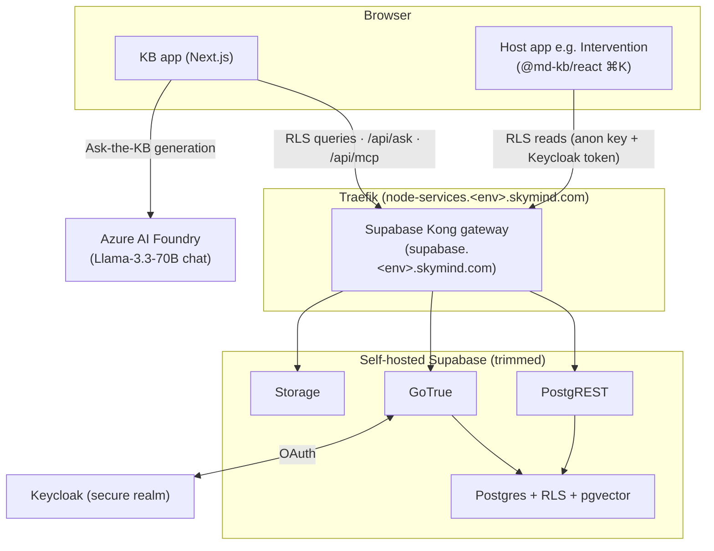

# SkyCell Knowledge Base — Architecture

The single reference for how the KB ecosystem fits together: the standalone app,
the embeddable widget, how hosts integrate it, authn/authz, search & Ask-the-KB,
the MCP connector, and how it's deployed. For deep dives see the linked ADRs and
runbooks.

## Overview

The KB is a self-hosted, RLS-secured knowledge base for internal,
compliance-sensitive (pharma cold-chain) content. It ships in two forms:

1. **Standalone app** — a Next.js site (`/knowledge-base`) with reading,
   full-text + fuzzy search, "Ask the KB", and an editorial workspace
   (drafts, mandatory review, version history, trash, audit, templates).
2. **Embeddable widget** — `@md-kb/react`, a read-only React component
   other SkyMind apps drop in (e.g. the Intervention client's ⌘K launcher). The
   host talks to the KB's Supabase directly; RLS is the boundary.

Both read the same Supabase (Postgres + PostgREST + GoTrue + Storage), and both
are recognisably one product via shared design tokens.

## Repositories & packages

| Repo / package | Role |
| --- | --- |
| **`knowledge-base-app`** (this repo) | npm-workspaces monorepo: the Next.js app + the packages below + the self-hosted Supabase stack (`deploy/supabase/`) |
| `packages/kb-core` | Framework-agnostic shared model (article types, `ARTICLE_LIST_COLUMNS`, `isPublicArticle`, brand design tokens). **Private** — bundled into kb-react, transpiled into the app. Single source of truth. |
| `packages/kb-react` → **`@md-kb/react`** | The embeddable widget (MUI). Published to GitHub Packages. Bundles kb-core (ships self-contained types). |
| **`intervention-client`** (separate repo) | A host: mounts the ⌘K launcher + `/knowledge` page via `@md-kb/react`. |
| **`fe-node-services`** (separate repo) | Hosts the deploy workflows + the Azure self-hosted runner + shared Traefik. |

## Component diagram

## Authentication

- Users sign in with **Keycloak** (`secure` realm). Today GoTrue brokers that
  via OAuth and mints a Supabase session; the embed completes the grant with a
  silent-iframe/popup that lands on the host's `/kb-auth` page, so each
  embedding host's origin must be in `GOTRUE_URI_ALLOW_LIST` (the `EMBED_ORIGINS`
  plumbing). Entitlements come from the Keycloak `groups` claim.
- **Planned simplification:** [ADR-0002](adr/0002-direct-keycloak-supabase-auth.md)
  — have PostgREST validate the Keycloak JWT directly (JWKS), so the client just
  passes its token (`supabase-js` `accessToken`). Removes the iframe grant,
  `/kb-auth`, `EMBED_ORIGINS`, and the role-sync RPC. To be done behind a flag.

## Authorization (RLS is the boundary)

- Visibility and writes are enforced in Postgres via Row-Level Security, so they
  hold regardless of an app bug. PostgREST is effectively an unwritten backend.
- **Editorial roles** (`profiles.role`): `admin` / `editor` / `reviewer` /
  `viewer`. `role_source` ('auto' from Keycloak groups, 'manual' admin-pinned)
  so admin overrides survive login re-sync.
- **Entitlement roles** (`access_roles`): synced from Keycloak ∪
  `manual_access_roles` (admin grants that survive re-sync). An article is
  readable if public (no roles / `BASIC_ACCESS`) or the user holds any of its
  `access_roles`. Editors may write an article only if it's public or they hold
  **all** of its roles (`can_write_article`).
- **Publish gate:** editors submit for review; only admin/reviewer can move an
  article to `published` (`enforce_publish_gate` trigger). Every change snapshots
  an immutable revision; reviewers see a diff-since-last-published.

## Search & Ask-the-KB

- **Keyword search (⌘K):** Postgres full-text (`search_tsv`, `websearch`) +
  `pg_trgm` trigram fuzzy matching on titles, via the `search_articles` RPC
  (invoker-rights → RLS-scoped).
- **Ask-the-KB:** retrieval-augmented generation. Retrieval is **semantic**
  (pgvector `match_article_chunks`) when an embeddings model is configured,
  otherwise **lexical** (FTS `match_articles_fts`) — so it works with chat only.
  Generation runs on **Azure AI Foundry** (`KB_AZURE_OPENAI_*`, Llama-3.3-70B)
  or any OpenAI-compatible `LLM_URL`. Provider-agnostic client in
  `src/lib/inference.ts`.
- **Status:** semantic/hybrid retrieval is parked pending a subscribable
  embeddings model on the Foundry (it's chat-only today). The vector path is
  built and flips on via `EMBEDDINGS_*` env; a reranker (e.g. Cohere-rerank)
  would slot in then.

## MCP connector

A remote MCP server at `/api/mcp` (`mcp-handler` + MCP SDK) lets Claude search
the KB and create **draft** articles (`create_draft_article`, `search_kb_articles`,
`list_kb_folders`). Drafts only — a human reviews/publishes through the normal
gate. Static bearer auth (`MCP_API_TOKEN`); writes via the service-role client,
constrained in code to `status='draft'`. See
[docs/MCP-CONNECTOR.md](MCP-CONNECTOR.md).

## Host integration (the widget)

- `@md-kb/react` exports `KbProvider` + `KnowledgeBase`, a global
  **`KbLauncher`** (⌘K modal), **`KbRelated`** (contextual related-articles by
  stable `context_keys`, not URLs), and `createKbTheme` (on-brand MUI theme from
  kb-core tokens; hosts with their own theme keep it — e.g. Validaide teal).
- The host passes its Supabase URL, anon (publishable) key, and a
  `getKeycloakToken` callback; reads are RLS-scoped to the user.

## Deployment

Self-hosted on the `fe-node-services` Azure stack behind Traefik. The Supabase
stack is **trimmed** to `db · auth · rest · storage · kong` (Studio + postgres-meta
dropped to shrink the public surface). Single public entrypoint is Kong at
`supabase.<env>.skymind.com`; the app at `node-services.<env>.skymind.com/knowledge-base`.

| Workflow (repo) | Purpose |
| --- | --- |
| `deploy-supabase` (fe-node-services) | Stand up / update the Supabase stack; feeds `EMBED_ORIGINS` from a repo Variable |
| `build-knowledge-base` (fe-node-services) | Build + deploy the Next.js image (NEXT_PUBLIC_* baked in) |
| `db-migrate` (fe-node-services) | Apply idempotent `supabase/migrations.sql` to the live DB (as `supabase_admin`) |
| `release-kb-react` (this repo) | Publish `@md-kb/react` to GitHub Packages |

Schema-as-code: `supabase/schema.sql` (first-boot) + idempotent
`supabase/migrations.sql` (applied to running DBs). See
[docs/DEPLOY.md](DEPLOY.md) and [deploy/supabase/RUNBOOK.md](../deploy/supabase/RUNBOOK.md).

## Simplification program — what shipped

| # | Change | Where |
| --- | --- | --- |
| 1 | Direct Keycloak→Supabase auth (spike) | ADR-0002 (`#27`) — implementation pending |
| 2 | Monorepo + shared `kb-core` (kill duplication) | `#30` |
| 3 | Trim self-hosted Supabase (drop Studio/meta) | `#29` |
| 4 | Ask-the-KB on Azure Foundry (chat) | `#28` |
| 5 | Hybrid/semantic search | **blocked** on an embeddings model; lexical path shipped (`#36`) |
| 6 | ⌘K launcher | `#34` (widget) · intervention-client `#3266` (host) |
| 7 | Shared design tokens + `createKbTheme` | `#34` |
| 8 | Review-as-diff from version history | `#33` |
| 9 | Lockfile-in-sync CI guard | intervention-client `#3265` |
| 10 | Contextual related-articles (`context_keys`) | `#34` |
| 11 | Remote MCP connector | `#32` |

## Open / future

- **Auth migration (ADR-0002):** implement behind an `authMode` flag; retires the
  iframe grant + `EMBED_ORIGINS` + role-sync RPC.
- **Semantic + hybrid search:** add an embeddings model (`text-embedding-3-*` or
  Cohere embed) via `EMBEDDINGS_*`, re-embed, optionally add a reranker.
- **kb-react `KbRelated` deep-link:** open `KbLauncher` at a specific slug.
